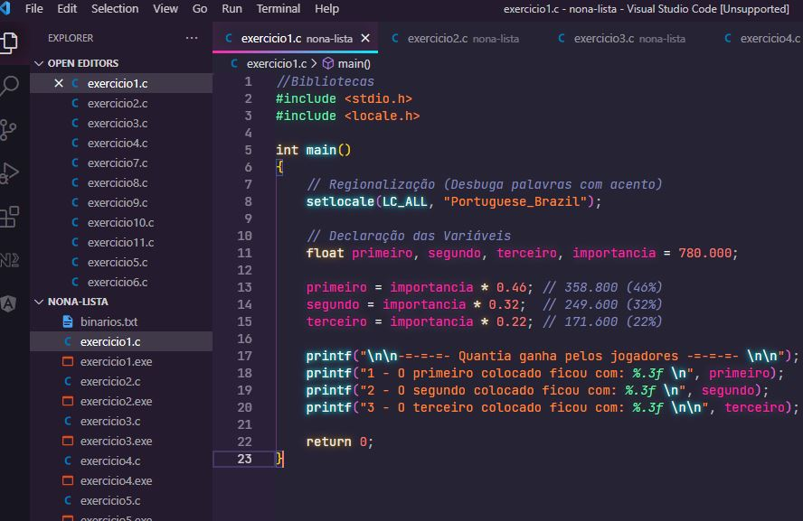

<h1 align="center">
    
</h1>

    <h3> 🔵 Oitava Lista 🔵 </h3>
    
     
    

## Lista 8

Lista de exercícios para praticar algoritmo estruturado e lógica de programação.

## Questões

1.	A importância de R$ 780.000,00 será dividida entre três ganhadores de um concurso.
Sendo que da quantia total:
•	O primeiro ganhador receberá 46%;
•	O segundo receberá 32%;
•	O terceiro receberá o restante;
Calcule e imprima a quantia ganha por cada um dos ganhadores.

2.	Uma empresa contrata um encanador a R$ 30,00 por dia. Crie um programa que solicite o número de dias trabalhados pelo encanador e imprima a quantia líquida que deverá ser paga, sabendo-se que são descontados 8% para imposto de renda. 

3.	Dados três valores, A, B, C, verificar se eles podem ser valores dos lados de um triângulo e, se forem se é um tri ângulo escaleno, um triângulo equilátero ou um triângulo isóscele.
Considerando os seguintes conceitos:
•	O comprimento de cada lado de um triângulo é menor do que a soma dos outros dois lados.
•	Chama-se equilátero o triângulo que tem três lados iguais.
•	Denominam-se isósceles o triângulo que tem o comprimento de dois lados iguais.
•	Recebe o nome de escaleno o triângulo que tem os três lados diferentes.

4.	Escreva um programa em C que escreva na tela de 1 em 1, de 1 até 100, 3 vezes. A primeira vez deve usar a estrutura de repetição for, a segunda while, e a terceira do while.

5.	Escreva um programa que leia um número inteiro positivo n e em seguida imprima n linhas do chamado Triangulo de Floyd: Ex. 4
	1
	2 3
	4 5 6
	7 8 9 10

6.	Faça um programa que leia um vetor de 10 posições e verifique se existem valores iguais e os escreva.

7.	Faça um programa que leia um vetor de cinco posições para números reais e, depois, um código inteiro. Se o código for zero, finalize o programa; se for 1, mostre o vetor na ordem direta; se for 2, mostre o vetor na ordem inversa. Caso, o código for diferente de 1 e 2 escreva uma mensagem falando que o código ´e inv´ alido. 

8.	Ler uma frase e contar quantos caracteres são brancos. Lembre-se que uma frase ´e um conjunto de caracteres (vetor).

9.	Ler uma variável string (3 caracteres) que pode assumir um valor entre seg, ter, qua, qui, sex, sab, dom, e imprimir as seguintes mensagens, respectivamente: segunda-feira, terça-feira, quarta-feira, quinta-feira, sexta-feira, sábado e domingo. Utilize o comando ”case”.

10.	Faça um programa em C que recebe um vetor de n números, converta cada um desses números para binário e grave a sequência de 0s e 1s em um arquivo texto. Cada número deve ser gravado em uma linha.

11.	Faça um programa que leia um arquivo com os preços de diversos produtos, e calcule o total da compra.

## 🛠️ Linguagem

💻 C

### ☑️ Código:

## 🌟 CEFET / RJ

Essa lista foi passada no meu curso de Sistemas de Informação realizado no CEFET.

